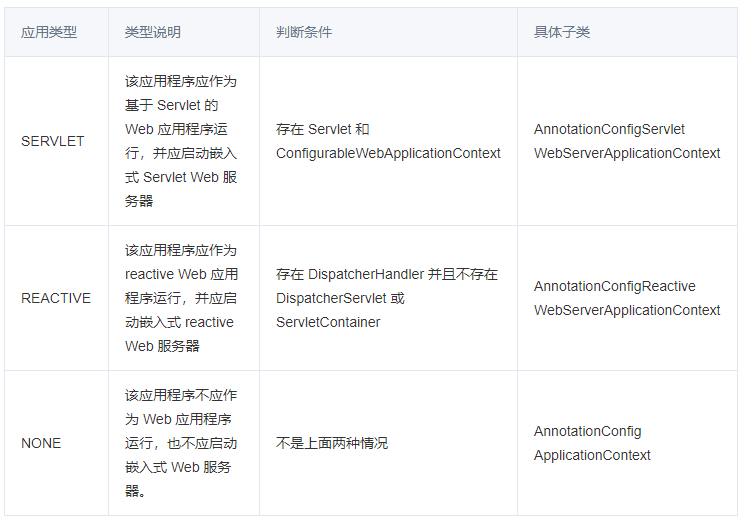

### scg NettyWebServer启动过程
spring cloud gateway(下面简称scg)依赖spring webflux, 而spring webflux依赖于reactor-netty,也就是scg启动过程中最终会启动netty做为服务器。
springboot中定义一下几种服务器：


#### 1 启动ReactiveWebServerApplicationContext 
从springboot启动开始分析
```java
SpringApplication.run(GatewayApplication.class, args);
```
设置webApplicationType的值：REACTIVE还是servlet的。
```java
public SpringApplication(ResourceLoader resourceLoader, Class<?>... primarySources) {
		this.resourceLoader = resourceLoader;
		Assert.notNull(primarySources, "PrimarySources must not be null");
		this.primarySources = new LinkedHashSet<>(Arrays.asList(primarySources));
		this.webApplicationType = WebApplicationType.deduceFromClasspath();//fzb 通过类路径中类，推测web应用类型：REACTIVE还是servlet的。
		setInitializers((Collection) getSpringFactoriesInstances(ApplicationContextInitializer.class));
		setListeners((Collection) getSpringFactoriesInstances(ApplicationListener.class));
		this.mainApplicationClass = deduceMainApplicationClass();
	}
```
再看deduceFromClasspath方法：判断DispatcherHandler存在还是DispatcherServlet存在
```java
static WebApplicationType deduceFromClasspath() {//fzb 判断DispatcherHandler存在还是DispatcherServlet存在
		if (ClassUtils.isPresent(WEBFLUX_INDICATOR_CLASS, null) && !ClassUtils.isPresent(WEBMVC_INDICATOR_CLASS, null)
				&& !ClassUtils.isPresent(JERSEY_INDICATOR_CLASS, null)) {
			return WebApplicationType.REACTIVE;
		}
		for (String className : SERVLET_INDICATOR_CLASSES) {
			if (!ClassUtils.isPresent(className, null)) {
				return WebApplicationType.NONE;
			}
		}
		return WebApplicationType.SERVLET;
	}
```
在此scg项目有DispatcherHandler类，所以是REACTIVE，响应式的。
下面接着创建相应的响应式容器
```java
protected ConfigurableApplicationContext createApplicationContext() {
		Class<?> contextClass = this.applicationContextClass;
		if (contextClass == null) {
			try {
				switch (this.webApplicationType) {//fzb 根据webApplicationType类型创建不同的context容器
				case SERVLET:
					contextClass = Class.forName(DEFAULT_SERVLET_WEB_CONTEXT_CLASS);
					break;
				case REACTIVE:
					contextClass = Class.forName(DEFAULT_REACTIVE_WEB_CONTEXT_CLASS);//fzb scg创建的容器
					break;
				default:
					contextClass = Class.forName(DEFAULT_CONTEXT_CLASS);
				}
			}
			catch (ClassNotFoundException ex) {
				throw new IllegalStateException(
						"Unable create a default ApplicationContext, please specify an ApplicationContextClass", ex);
			}
		}
		return (ConfigurableApplicationContext) BeanUtils.instantiateClass(contextClass);
	}
```
各类容器选择总结



#### 2  ReactiveWebServerApplicationContext刷新
先创建了
org.springframework.boot.autoconfigure.web.reactive.ReactiveWebServerFactoryAutoConfiguration中配置了EmbeddedNetty，初始化了NettyReactiveWebServerFactory

ReactiveWebServerApplicationContext容器刷新时通过ReactiveWebServerFactory创建WebServerManager
```java

protected void onRefresh() {
		super.onRefresh();
		try {
			createWebServer();//fzb 创建WebServerManager
		}
		catch (Throwable ex) {
			throw new ApplicationContextException("Unable to start reactive web server", ex);
		}
	}

private void createWebServer() {//fzb 通过ReactiveWebServerFactory创建WebServerManager
		WebServerManager serverManager = this.serverManager;
		if (serverManager == null) {
			String webServerFactoryBeanName = getWebServerFactoryBeanName();
			ReactiveWebServerFactory webServerFactory = getWebServerFactory(webServerFactoryBeanName);
			boolean lazyInit = getBeanFactory().getBeanDefinition(webServerFactoryBeanName).isLazyInit();
			this.serverManager = new WebServerManager(this, webServerFactory, this::getHttpHandler, lazyInit);//fzb 创建
			getBeanFactory().registerSingleton("webServerGracefulShutdown",
					new WebServerGracefulShutdownLifecycle(this.serverManager));
			getBeanFactory().registerSingleton("webServerStartStop",
					new WebServerStartStopLifecycle(this.serverManager));
		}
		initPropertySources();
	}
```
再看WebServerManager初始化时，再通过ReactiveWebServerFactory 初始化创建NettyWebServer  
```java
WebServerManager(ReactiveWebServerApplicationContext applicationContext, ReactiveWebServerFactory factory,
			Supplier<HttpHandler> handlerSupplier, boolean lazyInit) {
		this.applicationContext = applicationContext;
		Assert.notNull(factory, "Factory must not be null");
		this.handler = new DelayedInitializationHttpHandler(handlerSupplier, lazyInit);
		this.webServer = factory.getWebServer(this.handler);//fzb scg中创建NettyWebServer
	}
```

下面是ReactiveWebServerFactory初始化创建NettyWebServer的过程，实际是创建reactor.netty 的HttpServer，通过适配器模式ReactorHttpHandlerAdapter，适配为NettyWebServer 返回
```java
	public WebServer getWebServer(HttpHandler httpHandler) {
		HttpServer httpServer = createHttpServer();//fzb 创建reactor.netty 的HttpServer
		ReactorHttpHandlerAdapter handlerAdapter = new ReactorHttpHandlerAdapter(httpHandler);//通过ReactorHttpHandlerAdapter适配器模式适配
		NettyWebServer webServer = new NettyWebServer(httpServer, handlerAdapter, this.lifecycleTimeout, getShutdown());//HttpServer 适配为NettyWebServer
		webServer.setRouteProviders(this.routeProviders);
		return webServer;
	}
```


